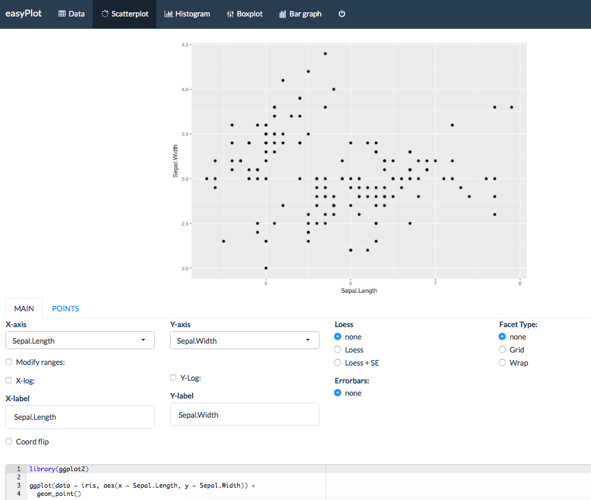

<!-- README.md is generated from README.Rmd. Please edit that file -->

# easyPlot

## Overview

[easyPlot](https://github.com/majkamichal/easyPlot) is an intuitive
graphical user interface (GUI) meticulously designed for
[ggplot2](https://ggplot2.tidyverse.org). `easyPlot` serves as a
powerful tool, allowing users to effortlessly create four fundamental
types of graphs — scatterplots, histograms, boxplots, and bar charts —
with just a few clicks.

***Key Features and Advantages:***

- **Seamless Data Upload:** `easyPlot` simplifies the data import
  process by supporting various file formats, including `csv`, `xlsx`,
  and `txt`. This ensures a seamless experience for users, allowing them
  to start visualizing their data without unnecessary hurdles.

- **Swift Visualization of Variables:** The tool provides a swift and
  interactive environment for visualizing different variables within the
  dataset. Users can quickly explore patterns, trends, and relationships
  within their data.

- **Multivariate Visualizations:** Harnessing the power of `ggplot2`’s
  facet grids and aesthetics, `easyPlot` enables users to visualize
  multiple variables simultaneously on a single graph. This feature
  enhances the depth of data exploration, allowing users to uncover
  intricate relationships between multiple dimensions.

- **Flexible Style Experimentation:** `easyPlot` offers a flexible
  platform for experimenting with the visual style of the generated
  plots. Users can customize colors, themes, and other visual elements
  to tailor the appearance of their graphs to suit their preferences.

- **interactive Scatterplot:** `easyPlot` features an interactive
  scatterplot where users can seamlessly identify outliers, calculate
  simple summary statistics for marked points, and efficiently zoom into
  specific areas of the graph. This functionality enhances the utility
  of the scatterplot for various data exploration purposes.

- **Reproducibility:** One of the standout features of `easyPlot` is its
  ability to generate reproducible code. The tool automatically
  generates `R code` corresponding to the created plots, allowing users
  to reproduce their visualizations easily or integrate them into their
  R scripts and reports.

**Future Development:**

The development of `easyPlot` is an ongoing process, and I am committed
to enhancing its functionality and user experience. User feedback will
be incorporated to ensure `easyPlot` remains a valuable asset in the
data visualization toolbox.

Take a look at [easyPlot](https://github.com/majkamichal/easyPlot) and
feel welcome to contribute. We’re building this tool together to make
data visualization more accessible.

## Installation

``` r
devtools::install_github("majkamichal/easyPlot")
```

## Usage

``` r
easyPlot::easyPlot()
easyPlot::easyPlot(iris)
```


